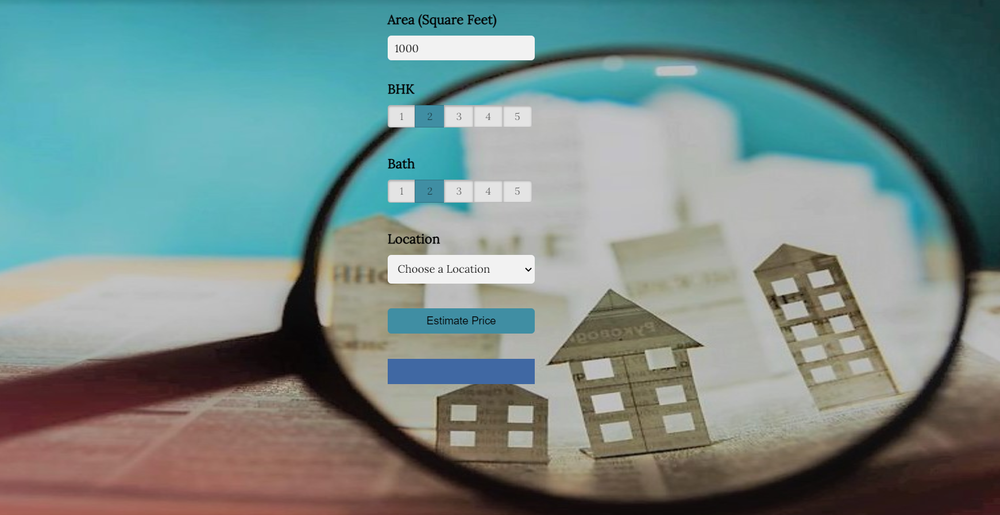

# real_state_price_prediction : overview
*Project to estimate real state house price.
*Build a model using sklearn and linear regression using banglore home prices dataset from kaggle.com.
*flask server that uses the saved model to serve http requests. 
*Built website built in html, css and javascript ,user will  enter home square ft area, bedrooms  and this  will call flask server to retrieve the predicted price.
*data science concepts used such as data load and cleaning, outlier detection and removal, feature engineering, dimensionality reduction, gridsearchcv for hyperparameter tunning, k fold cross validation.
### Code and Resources Used
* Python version: 3.8.3
* Packages: pandas, numpy, sklearn, matplotlip, seaborn, flask, json, pickle
* For web Framework Requirements: '''pip install -r requirements.txt'''
* Flask Production: https://towardsdatascience.com/productionize-a-machine-learning-model-with-flask-and-heroku-8201260503d2
 *banglore home prices dataset from kaggle.com
 
 

